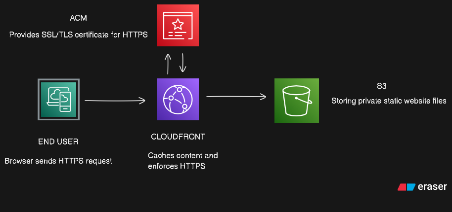

# AWS Resume Hosting Project

## 📌 Project Description
This project demonstrates how to host a secure, highly available resume website on AWS using **S3**, **CloudFront**, **Route 53**, and **AWS Certificate Manager (ACM)**.  

The front‑end is built with **HTML, CSS, and JavaScript**, stored in an S3 bucket, distributed globally with CloudFront, secured with HTTPS via ACM, and mapped to a custom domain through Route 53.  

This project shows recruiters my ability to design, deploy, and manage a static web application in AWS using production‑ready best practices.

---

## 🚀 Features
- Static website hosting with Amazon S3  
- Global content delivery using Amazon CloudFront  
- Secure HTTPS traffic via AWS Certificate Manager  
- Custom domain integration with Route 53  
- HTML, CSS, and JavaScript front‑end  
- Version control with S3 bucket versioning  

---

## 🛠️ Architecture
- **Amazon S3:** Stores static website files.  
- **Amazon CloudFront:** CDN for low latency content delivery.  
- **AWS Certificate Manager:** Issues and manages SSL/TLS certificates.  
- **Amazon Route 53:** Custom domain and DNS routing.  

---

## 📖 Step‑by‑Step Guide

### 1️⃣ Plan the Architecture
- Create an architecture diagram showing: User → Route 53 → CloudFront → S3 → Website.  
- *Screenshot:* `diagram-export-8-1-2025-1_10_51-PM.png`

### 2️⃣ Set Up S3 Bucket for Website Hosting
- Create a new S3 bucket named `your-domain.com`.
- Enable static website hosting and upload your HTML, CSS, and JavaScript files.  
- *Screenshot:* `screenshots/s3-setup.png`

### 3️⃣ Configure Bucket Policy for CloudFront Access
- Add a bucket policy allowing only CloudFront to read objects.  
- *Screenshot:* `screenshots/s3-policy.png`

### 4️⃣ Request an SSL/TLS Certificate with ACM
- Use AWS Certificate Manager to request a public certificate for your domain.  
- Validate ownership via DNS or email.  
- *Screenshot:* `screenshots/acm-issued.png`

### 5️⃣ Create a CloudFront Distribution
- Set the S3 bucket as the origin.
- Attach the ACM certificate for HTTPS.
- Configure caching and default root object (index.html).  
- *Screenshot:* `screenshots/cloudfront-settings.png`

### 6️⃣ Configure Domain with Route 53
- Create a hosted zone for your domain.
- Add A/AAAA and CNAME records as needed.  
- *Screenshot:* `screenshots/route53-records.png`

### 7️⃣ Point CloudFront to Route 53
- Create an A record alias pointing to the CloudFront distribution.  
- *Screenshot:* `screenshots/route53-alias.png`

### 8️⃣ Deploy and Test the Website
- Visit your custom domain over HTTPS.
- Verify the site loads correctly.  
- *Screenshot:* `screenshots/live-site.png`

### 9️⃣ Enable Versioning & Backup
- Turn on versioning in the S3 bucket to preserve past versions of files.  
- *Screenshot:* `screenshots/s3-versioning.png`

### 🔟 Document & Package the Project
- Write this README and include all screenshots.
- Push all code and documentation to GitHub.  
- *Screenshot:* `screenshots/github-repo.png`

---

## 📂 Repository Structure
